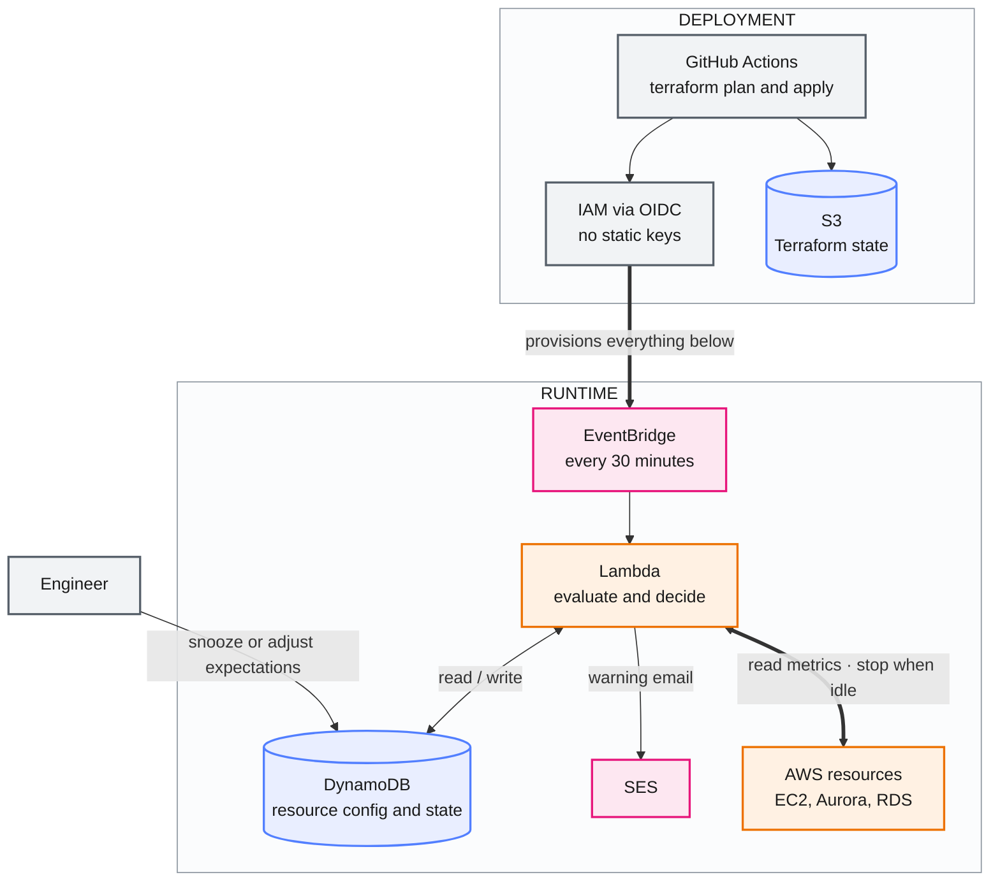
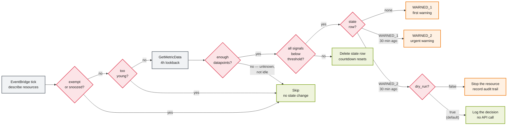
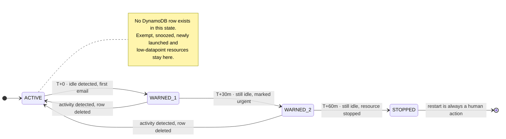

# AWS Idle Resource Manager

**Serverless FinOps automation that finds idle EC2, Aurora and RDS resources, warns the owner, and stops them if nobody responds.** Built entirely with Terraform and shipped through GitHub Actions using OIDC — no static AWS credentials anywhere in the system.


> **Project status:** design and architecture complete, implementation in progress. The full design document — execution flow, data model, IAM policies, rollout phases and operational runbook — is finished and drives the build. See [Roadmap](#roadmap) for what has landed so far.

---

## The problem

Non-production EC2 instances and databases get left running after the experiment ends. Nobody notices, because the cost is invisible day to day and only shows up in the monthly bill — by which point the money is already spent.

A single `m5.xlarge` forgotten for a month costs about **$145**. A dev Aurora cluster running 24/7 that's genuinely used four hours a day is paying for twenty hours of nothing.

Fixed start/stop schedules don't solve this. They either kill something someone is actively using, or they're set so conservatively they save nothing. This project takes a different approach: **measure whether the resource is actually idle, tell the owner, and give them a chance to object before acting.**

---

## Architecture

Two planes, deliberately separated. **GitHub Actions deploys and nothing else** — it holds no standing permission to stop a resource. **Everything with a timer runs inside AWS**, where the schedule is durable and the state survives between runs.



The Lambda's IAM policy names the managed resource ARNs explicitly. A logic bug cannot reach anything outside that list — IAM refuses the call before the code gets a say.

> **The detailed version lives in [`architecture.drawio`](architecture.drawio)** — official AWS architecture icons, every service and IAM boundary drawn out, editable in [diagrams.net](https://app.diagrams.net) or the draw.io VS Code extension. The diagram above is the same system with the detail stripped out. Deployed to a single account in **`ap-south-2` (Hyderabad)**.

---

## How it works

Every 30 minutes a single Lambda describes the managed resources, pulls their CloudWatch metrics in one batched call, and compares the result against lifecycle state held in DynamoDB.

### One tick, end to end



Four of those diamonds exist purely to avoid false positives, and two are worth calling out. The datapoint check comes before any threshold comparison: `GetMetricData` returns an empty array for a metric that isn't publishing, and treating that as `0` would stop a perfectly healthy database. The threshold check combines signals with **AND, never OR** — a resource has to look idle by *every* measure before the countdown starts.

### The escalation lifecycle



If the owner comes back and uses the resource at any point, the metrics reflect it on the next tick, the state row is deleted, and the countdown resets. **They never have to know this system exists.**

---

## What this project demonstrates

| Area | In practice |
|---|---|
| **Cloud architecture** | Event-driven serverless design across seven AWS services, with an explicit split between a deployment plane and a runtime plane |
| **Infrastructure as Code** | Terraform 1.10+ modules, native S3 state locking, a bootstrap-then-remote-backend pattern, strict configuration/state separation |
| **CI/CD and supply chain security** | GitHub Actions with OIDC federation — zero long-lived credentials, separate plan and apply roles, apply pinned to `main` behind an environment approval gate |
| **Security engineering** | Least-privilege IAM scoped to explicit resource ARNs, so a logic bug physically cannot reach unmanaged infrastructure |
| **Distributed systems fundamentals** | At-least-once delivery handled with conditional writes and reserved concurrency; idempotency treated as a design requirement, not an afterthought |
| **Production judgement** | Dry-run by default, a five-phase rollout that observes before it enforces, self-monitoring alarms, a dead letter queue, and a written operational runbook |
| **Cost engineering** | A cost model derived from actual AWS billing units, including a deliberate decision *not* to optimise something that turned out to be free |
| **Testing** | Decision logic written as pure functions with no AWS calls, so the bulk of the suite runs in CI with `pytest` + `moto` and no live account |
| **Technical writing** | A full design document covering goals, non-goals, rejected alternatives, data model, IAM, rollout and runbook |

---

## Engineering notes

The parts that took the most thought, and the reasons behind them.

### Missing metrics are not zero

`GetMetricData` returns an empty array when a metric isn't publishing — a resource that just launched, or one without detailed monitoring. A naive `avg(cpu) < 5` check treats that as `0` and stops a perfectly healthy database.

Every evaluation asserts a minimum datapoint count first and treats anything below it as *unknown*, not *idle*. This is the single most likely cause of a false shutdown and the first thing I built a test for.

### Three services, three different shutdown verbs

`StopInstances` only works on EC2. Aurora needs `StopDBCluster` targeting the cluster, RDS needs `StopDBInstance` targeting the instance. Aurora is the awkward one: `DatabaseConnections` is published *per member instance* but the stop verb is *cluster-level*, so idleness is evaluated across members and acted on at the cluster.

Each type is a handler behind a shared interface (`is_actionable`, `is_idle`, `shutdown`), which is what keeps the main loop readable.

### CPU alone is a bad idleness signal

A jump host sits at 2% CPU all day and is very much in use. A runaway process sits at 90% doing nothing useful. Signals are combined with **AND**, not OR — a resource has to look idle by every measure before the countdown starts.

### The scheduler belongs in AWS, not in GitHub Actions

A scheduled workflow was the obvious shortcut, and it was rejected. GitHub cron drifts and occasionally skips runs, there is no durable state between runs, a runner sleeping between emails burns minutes and can be killed mid-flight, and it would need standing AWS stop permissions living outside the deployment plane. GitHub Actions deploys; anything with a timer runs in AWS.

### One Lambda instead of Step Functions

An earlier draft used a state machine with wait states for the 30-minute gaps. Evaluating on a 30-minute tick turns those timers into timestamp comparisons in DynamoDB — Step Functions added a service without adding behaviour. The trade-off is that warning gaps fall between 30 and 60 minutes rather than exactly 30, which is fine at this cadence.

### `cron()` rather than `rate()`

`rate(30 minutes)` fires relative to when the rule was last modified, so ticks drift to arbitrary offsets after every deploy. `cron(0/30 * * * ? *)` fires at :00 and :30 consistently — which matters a lot when you're correlating log timestamps against elapsed-time thresholds during an incident.

### EventBridge delivers at-least-once

A duplicate invocation would double-send a warning or advance state twice. Two defences: reserved concurrency pinned to `1`, and a `ConditionExpression` on `status_since` so the second write is simply rejected.

### Terraform must not write to DynamoDB

The table holds live state — snooze timers, warning counts. If Terraform seeded rows, every `terraform apply` would silently reset an in-flight escalation and the owner would never receive their second warning.

Configuration lives in Terraform variables; state lives in DynamoDB and is written only by the Lambda. The two never overlap.

### Batching saves latency, not money

`GetMetricData` bills per metric *requested*, not per API call. Batching 600 metrics into two calls costs exactly the same as 600 individual calls — it buys throttle headroom and runtime, not dollars. Worth knowing before optimising the wrong thing.

---

## Safety

Automating shutdown of other people's infrastructure demands a low tolerance for bugs. In rough order of how much each one matters:

| Control | What it does |
|---|---|
| **IAM scoped to explicit ARNs** | A logic bug physically cannot reach unmanaged resources — IAM refuses the call before the code matters |
| **Dry-run mode** | Evaluates and logs the decision, skips the mutating call. Defaults to `true`. |
| **Reserved concurrency = 1** | No overlapping invocations |
| **Conditional writes** | Duplicate delivery becomes a no-op |
| **Exempt / snooze tags** | Permanent and temporary opt-out |
| **Dead letter queue** | A silently failing reaper is worse than no reaper |
| **Audit trail** | Metric values at decision time are stored, so any shutdown can be explained |
| **Self-monitoring alarms** | Lambda errors, missing invocations, DLQ depth and duration — a cost tool that quietly stops working is worse than no tool, because everyone assumes it's running |

Termination is never automated. The system stops resources and nothing else; bringing one back is always a deliberate human action.

---

## Stack

| Layer | Choice | Why |
|---|---|---|
| IaC | Terraform 1.10+ | Native S3 state locking, no DynamoDB lock table |
| CI/CD | GitHub Actions + OIDC | Short-lived credentials, environment-gated apply |
| Compute | Lambda, Python 3.12, arm64 | ~20% cheaper than x86, boto3 preinstalled |
| Scheduling | EventBridge | Managed cron, DLQ support |
| State | DynamoDB on-demand | TTL handles cleanup, no capacity planning |
| Email | Amazon SES | Domain identity, HTML templates. Called via the `SendEmail` API — `ap-south-2` has no SES SMTP endpoint, which the design doesn't need |
| Region | `ap-south-2` (Hyderabad) | Single account; every service in the stack is available there |
| Testing | pytest + moto | Mocked AWS, no live account needed for CI |

---

## Getting started

### Prerequisites

- Terraform >= 1.10
- AWS account with permission to create IAM roles
- A GitHub repository
- SES production access ([takes ~24h](https://docs.aws.amazon.com/ses/latest/dg/request-production-access.html) — request early)

### 1. Bootstrap

The state bucket has to exist before Terraform can use it as a backend, so this runs once with local state:

```bash
cd bootstrap
terraform init
terraform apply
```

Creates the versioned state bucket, the GitHub OIDC provider, and the plan/apply CI roles.

### 2. Configure

```hcl
# terraform.tfvars
aws_region = "ap-south-2"

managed_resources = [
  { arn = "arn:aws:ec2:ap-south-2:123456789012:instance/i-0abc", type = "ec2" },
  { arn = "arn:aws:rds:ap-south-2:123456789012:cluster:dev-aurora", type = "aurora" },
]

dry_run         = true      # keep this until you trust the thresholds
notify_fallback = "platform-team@example.com"
```

### 3. Deploy

Open a pull request. `terraform plan` runs automatically and comments the diff. Merge to `main` and the apply workflow runs behind a GitHub environment approval gate.

### 4. Observe before enforcing

Leave `dry_run = true` for at least a week. The logs will show what *would* have been stopped. The initial thresholds are guesses and yours will be different — this is where you find the right numbers.

---

## Configuration

| Variable | Default | Description |
|---|---|---|
| `tick_schedule` | `cron(0/30 * * * ? *)` | Evaluation frequency |
| `lookback_hours` | `4` | Metric history evaluated per tick |
| `warning_gap_minutes` | `30` | Gap between escalation steps |
| `min_datapoints` | `20` | Below this, skip as unknown |
| `min_resource_age_hours` | `6` | Ignore recently launched resources |
| `ec2_cpu_threshold` | `5.0` | Percent, averaged over the window |
| `ec2_network_threshold_mb` | `5` | Combined in + out |
| `dry_run` | `true` | Log decisions without acting |

Thresholds are provisional by design. The rollout plan replaces them with measured values from a week of dry-run logs before enforcement is switched on.

### Tags

| Tag | Effect |
|---|---|
| `idle-guard:exempt = true` | Never managed |
| `idle-guard:snooze-until = <ISO8601>` | Skipped until that time |
| `Owner = <email>` | Warning recipient |
| `aws:autoscaling:groupName` | Auto-skipped — ASG members get replaced, not stopped |

---

## Testing

```bash
pip install -r requirements-dev.txt
pytest                        # unit tests, moto-mocked AWS
pytest -m integration         # against a real account, requires credentials
```

The idleness evaluation and decision logic are pure functions with no AWS calls, so the bulk of the test suite runs without any account access. Edge cases covered include empty metric responses, resources younger than the lookback window, partial metric availability, and duplicate invocation handling.

---

## Cost

Running against six resources: **under $1/month**, almost all of it CloudWatch `GetMetricData` at $0.01 per 1,000 metrics requested.

```
monthly $ = resources × metrics_each × ticks_per_month × 0.00001
```

At 200 resources it's roughly $9/month. **Don't enable EC2 detailed monitoring** — at ~$2.10 per instance per month it would cost 35× the entire system to buy 1-minute granularity that a 4-hour lookback window doesn't need.

Catching one forgotten `m5.xlarge` a single time pays for the system for over a decade.

---

## Project structure

```
├── bootstrap/              # run once: state bucket, OIDC provider, CI roles
├── modules/idle-guard/     # lambda, dynamodb, eventbridge, ses, iam
├── lambda/
│   ├── handler.py          # main loop
│   ├── handlers/           # ec2.py, aurora.py, rds.py
│   ├── evaluation.py       # idleness logic — pure functions
│   └── tests/
├── architecture.drawio     # AWS architecture diagram, official icons
└── .github/workflows/      # plan.yml, apply.yml
```

---

## Limitations

Honest list of what this doesn't handle yet:

- **Single account.** Multi-account would need hub-and-spoke role assumption.
- **AWS auto-starts stopped RDS and Aurora after 7 days** for maintenance. The reaper re-detects and re-runs the cycle, but there's no snapshot-and-delete path.
- **Aurora Serverless v2 can't be stopped** and is excluded — it already scales toward zero.
- **No one-click snooze link** in the emails. Snoozing means setting a tag or just using the resource. A signed-token endpoint is on the roadmap.
- **Explicit resource list rather than discovery.** Correct at this scale, but tag-based discovery is the right call past ~20 resources.
- **Redshift not supported.** It has no stop API — `PauseCluster` behaves differently enough to need its own handler.

---

## Roadmap

- [x] Design document — architecture, execution flow, data model, IAM, rollout, runbook
- [ ] Bootstrap Terraform — state bucket, OIDC provider, CI roles
- [ ] `idle-guard` module — Lambda, DynamoDB, EventBridge, SES, IAM
- [ ] Reaper Lambda and per-service handlers
- [ ] Plan / apply GitHub Actions workflows
- [ ] SSM Parameter Store kill switch
- [ ] One-click snooze via API Gateway + signed tokens
- [ ] Tag-based discovery for larger fleets
- [ ] Slack notifications alongside email
- [ ] Reconciliation for the 7-day database auto-restart

---

## License

MIT
